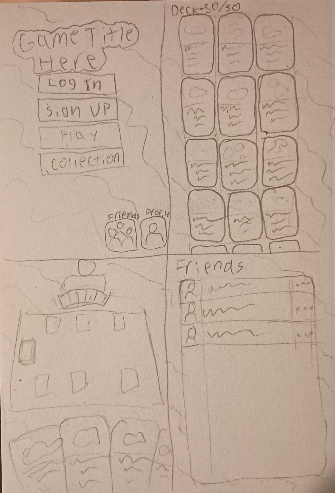
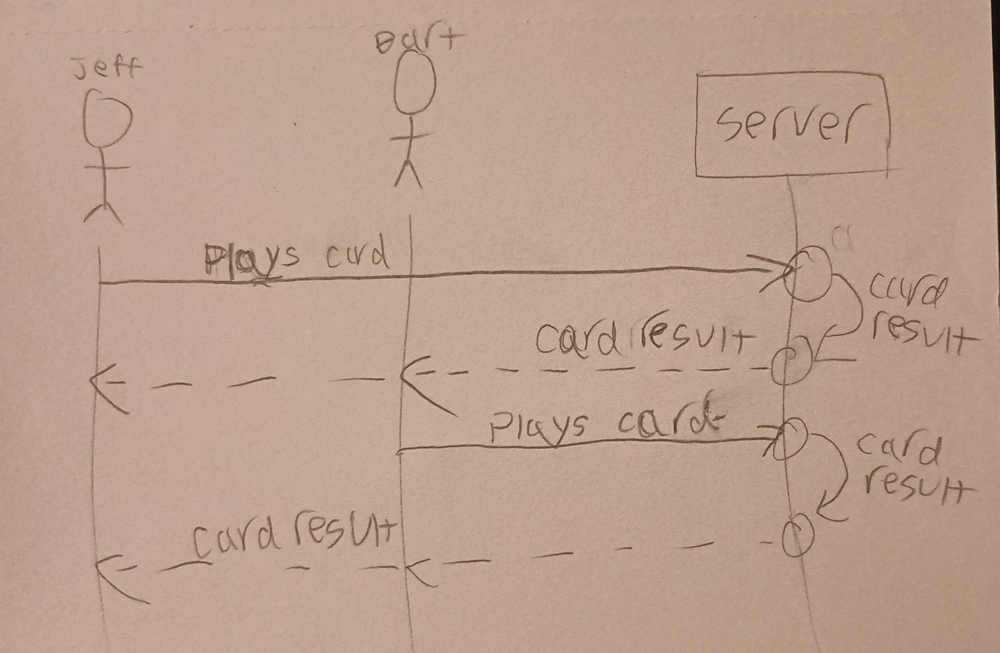

# Your startup name here

[My Notes](notes.md)

A brief description of the application here. Lorem ipsum dolor sit amet, consectetur adipiscing elit, sed do eiusmod tempor incididunt ut labore et dolore magna aliqua. Ut enim ad minim veniam, quis nostrud exercitation ullamco laboris nisi ut aliquip ex ea commodo consequat. Duis aute irure dolor in reprehenderit in voluptate velit esse cillum dolore eu fugiat nulla pariatur. Excepteur sint occaecat cupidatat non proident, sunt in culpa qui officia deserunt mollit anim id est laborum.

> [!NOTE]
>  This is a template for your startup application. You must modify this `README.md` file for each phase of your development. You only need to fill in the section for each deliverable when that deliverable is submitted in Canvas. Without completing the section for a deliverable, the TA will not know what to look for when grading your submission. Feel free to add additional information to each deliverable description, but make sure you at least have the list of rubric items and a description of what you did for each item.

> [!NOTE]
>  If you are not familiar with Markdown then you should review the [documentation](https://docs.github.com/en/get-started/writing-on-github/getting-started-with-writing-and-formatting-on-github/basic-writing-and-formatting-syntax) before continuing.

## 🚀 Specification Deliverable

> [!NOTE]
>  Fill in this sections as the submission artifact for this deliverable. You can refer to this [example](https://github.com/webprogramming260/startup-example/blob/main/README.md) for inspiration.

For this deliverable I did the following. I checked the box `[x]` and added a description for things I completed.

- [x] Proper use of Markdown
- [x] A concise and compelling elevator pitch
- [x] Description of key features
- [x] Description of how you will use each technology
- [x] One or more rough sketches of your application. Images must be embedded in this file using Markdown image references.

### Elevator pitch

My startup will be a competitive card game where you can collect cards with different unique abilities and use them in battles with your friends. Each card you collect will be added to your deck, from which you can trade or destroy them to optimize your build. You then use them in battles against other players to collect more, and the cycle continues.

### Design

Top Left: Main menu. All buttons will be grayed out aside from login and sign up until the user does so. Top Right: Card collection screen. Users can view their cards, choose which ones are in their deck, trade with friends, and destroy extra cards for rewards. Bottom Left: Battle screen. Players can see cards in their hand, how many their opponent has, and the effects of cards change the play area in real time. Bottom Right: Friend list. Users can add friends through usernames saved on the database and see which of their friends are online, offer trades, or challenge them to battles.

Diagram of how users interact with the backend to play. On their turn, players choose which of their cards to play or otherwise make a move, which is sent to the server. The server interprets the play and updates the gamestate accordingly. The server then sends the update back to both users to update their screens.

### Key features

- Secure login over HTTPS
- Interactive card battles between users
- Ability to collect, trade, and destroy cards in the user's personal collection

### Technologies

I am going to use the required technologies in the following ways.

- **HTML** - Structure of application. HTML pages for menu/login, card collection, and play.
- **CSS** - Visual design, unique card graphics, and animations.
- **React** - interactive menu and gameplay behavior.
- **Service** - Backend service with endpoints for:
    - Login
    - Finding matches
    - Submitting player moves
    - Retrieving opponent moves
- **DB/Login** - Saving user login info, card collections, and gameplay statistics.
- **WebSocket** - Connecting players for PvP (player verse player) battles. Player moves are broadcast to their opponent(s).

## 🚀 AWS deliverable

For this deliverable I did the following. I checked the box `[x]` and added a description for things I completed.

- [x] **Server deployed and accessible with custom domain name** - [My server link](https://joshphister.click).

## 🚀 HTML deliverable

For this deliverable I did the following. I checked the box `[x]` and added a description for things I completed.

- [x] **HTML pages** - I created index.html for the main menu and login, as well as play.html, collection.html, friends.html, and about.html.
- [x] **Proper HTML element usage** - I learned and use several html tags.
- [x] **Links** - I linked the menu (index.html) to the other pages, and the other pages to the menu.
- [x] **Text** - About page has a brief description of the application.
- [ ] **3rd party API placeholder** - I did not complete this part of the deliverable, I still don't know where to use an API.
- [x] **Images** - About page has a design concept of the application.
- [x] **Login placeholder** - index.html has a login placeholder.
- [x] **DB data placeholder** - Collection and friends pages have data placeholders.
- [x] **WebSocket placeholder** - Play page has placeholder.

## 🚀 CSS deliverable

For this deliverable I did the following. I checked the box `[x]` and added a description for things I completed.

- [x] **Header, footer, and main content body** - I styled most pages using main.css, with each page using a specific css file.
- [x] **Navigation elements** - I styled nav elements to look like buttons, with responsive design.
- [x] **Responsive to window resizing** - Most pages will respond accordingly, but I had some issues with specific elements.
- [x] **Application elements** - Everything looks about how it should with the final product.
- [x] **Application text content** - I chose a nice, bubbly font for all the text in the application.
- [x] **Application images** - I left the about image pretty much as it was.

## 🚀 React part 1: Routing deliverable

For this deliverable I did the following. I checked the box `[x]` and added a description for things I completed.

- [x] **Bundled using Vite** - I used this for testing, viewing in-progress builds, and deploying the finished result.
- [x] **Components** - I moved all of my html over to react components and built the web page out of them using layout components.
- [x] **Router** - I switched the anchor tags with react nav links that correspond with routers to the correct components.

## 🚀 React part 2: Reactivity deliverable

For this deliverable I did the following. I checked the box `[x]` and added a description for things I completed.

- [x] **All functionality implemented or mocked out** - I mocked up most functionality.
- [x] **Hooks** - I used useState, UseEffect, and useContext.

## 🚀 Service deliverable

For this deliverable I did the following. I checked the box `[x]` and added a description for things I completed.

- [x] **Node.js/Express HTTP service** - Installed Express with NPM
- [x] **Static middleware for frontend** - Endpoints in service/index.js
- [x] **Calls to third party endpoints** - I called a random cat fact API on my about page.
- [x] **Backend service endpoints** - Endpoints in service/index.js
- [x] **Frontend calls service endpoints** - Mocked login functionality replace with calls to backend.
- [x] **Supports registration, login, logout, and restricted endpoint** - Authentication fully implemented.

## 🚀 DB deliverable

For this deliverable I did the following. I checked the box `[x]` and added a description for things I completed.

- [ ] **Stores data in MongoDB** - I did not complete this part of the deliverable.
- [ ] **Stores credentials in MongoDB** - I did not complete this part of the deliverable.

## 🚀 WebSocket deliverable

For this deliverable I did the following. I checked the box `[x]` and added a description for things I completed.

- [ ] **Backend listens for WebSocket connection** - I did not complete this part of the deliverable.
- [ ] **Frontend makes WebSocket connection** - I did not complete this part of the deliverable.
- [ ] **Data sent over WebSocket connection** - I did not complete this part of the deliverable.
- [ ] **WebSocket data displayed** - I did not complete this part of the deliverable.
- [ ] **Application is fully functional** - I did not complete this part of the deliverable.
